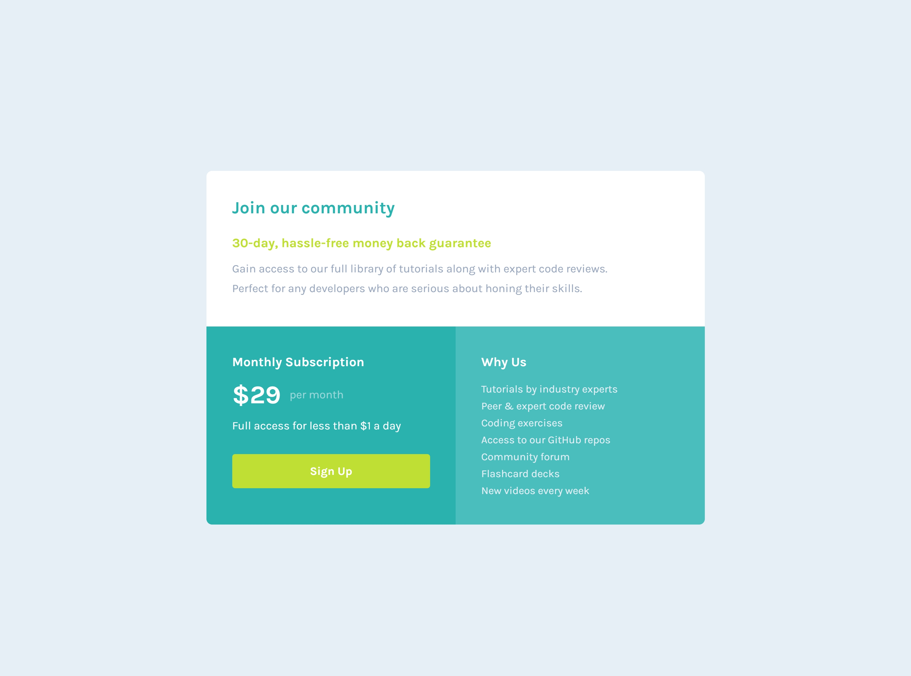

# Frontend Mentor - Single price grid component solution

This is a solution to the [Single price grid component challenge on Frontend Mentor](https://www.frontendmentor.io/challenges/single-price-grid-component-5ce41129d0ff452fec5abbbc). Frontend Mentor challenges help you improve your coding skills by building realistic projects. 

## Table of contents

- [Frontend Mentor - Single price grid component solution](#frontend-mentor---single-price-grid-component-solution)
  - [Table of contents](#table-of-contents)
  - [Overview](#overview)
    - [The challenge](#the-challenge)
    - [Screenshot](#screenshot)
    - [Links](#links)
  - [My process](#my-process)
    - [Built with](#built-with)
    - [What I learned](#what-i-learned)
    - [Useful resources](#useful-resources)
  - [Author](#author)

## Overview

### The challenge

Users should be able to:

- View the optimal layout for the component depending on their device's screen size
- See a hover state on desktop for the Sign Up call-to-action

### Screenshot

### Links

- Solution URL: [https://github.com/ShrutiShinde418/FrontendMentor1/tree/main/single-price-grid-component](https://github.com/ShrutiShinde418/FrontendMentor1/tree/main/single-price-grid-component)
- Live Site URL: [(https://frontend-mentor1-hazel.vercel.app/)](https://frontend-mentor1-hazel.vercel.app/)

## My process

### Built with

- Tailwind CSS

### What I learned

- Tailwind CSS

### Useful resources

- [Net Ninja Tailwind CSS Tutorial](https://www.youtube.com/watch?v=bxmDnn7lrnk&list=PL4cUxeGkcC9gpXORlEHjc5bgnIi5HEGhw) - This helped me in learning Tailwind CSS.

## Author

- Frontend Mentor - [@ShrutiShinde418](https://www.frontendmentor.io/profile/ShrutiShinde418)

